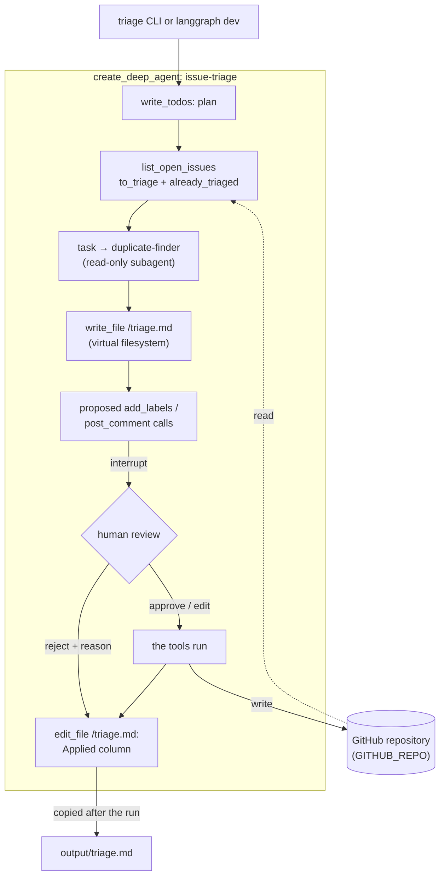

# GitHub Issue Triage Agent

A Deep Agents agent that triages the new issues of a GitHub repository. It plans its work,
reads the issues nobody has labelled yet, hands duplicate detection to a read-only
subagent, writes a `triage.md` report (a suggested label, a one-line reason, duplicate
pairs and a draft reply per issue), and then proposes labels and comments. **Every write
to GitHub waits for a human**, who can approve it, edit it or reject it.

Built with `create_deep_agent`, `write_todos` planning, a subagent, the virtual
filesystem, `interrupt_on`, PyGithub and LangSmith tracing.

**See it on a real repository:** [`brkakyldz/issue-triage-sandbox`](https://github.com/brkakyldz/issue-triage-sandbox)
is a public inbox for a fictional habit-tracker CLI. Every label and comment on its
issues was proposed by this agent and went through its review step before it was
applied: issues #1–#14 in the acceptance run below, whose scripted reviewer approves,
edits and rejects on purpose, and #10 and #15–#20 in the recorded demo.


In the demo, six new issues (#15–#20) have just arrived in a sandbox whose first 14
issues were triaged earlier. The run looks only at the seven issues without labels,
including #10, whose label an earlier reviewer rejected. A second run right after it
has nothing to do. The model's thinking time is shortened in the recording; the plan,
the subagent call and every tool call are in the [trace](#tracing).

## What it does

- Triages only the issues that have **no labels yet**, so it can run again and again on
  the same repository; `triage --all` re-triages everything.
- Suggests one main label per issue (`bug`, `enhancement`, `question`, `documentation`),
  plus `duplicate` and `good first issue` where they fit.
- Finds duplicates, including a new issue that repeats an older, already triaged one.
- Posts a comment only on duplicates, pointing to the original, and **never comments twice
  on the same issue**. The other draft replies stay in the report for a maintainer.
- Treats issue text as data. An issue that tries to give the bot orders is triaged on
  what it actually reports; the sandbox has one (#16) to show it.

## How it works



| Tool | What it does | Review |
|---|---|---|
| `list_open_issues()` | the open issues in two groups: `to_triage` (no labels yet, in full) and `already_triaged` (title, labels and the start of the body, for duplicate checks) | — |
| `get_issue(number)` | one issue with up to 20 comments | — |
| `add_labels(number, labels)` | adds labels (never replaces); only labels the repository already has, only on issues without labels | approve / edit / reject |
| `post_comment(number, body)` | posts a comment (1–1500 characters), at most one per issue | approve / edit / reject |

| Building block | Where it lives |
|---|---|
| `create_deep_agent` with a model instance, custom tools and a system prompt | [`agent.py`](src/issue_triage/agent.py) `build_agent()` |
| Planning with `write_todos` | `TodoListMiddleware()` (opt-in since deepagents 0.7) |
| A subagent | `duplicate-finder`: its own prompt, read-only tools, called through the `task` tool |
| Virtual filesystem | the report is written to `/triage.md` in graph state; `permissions` allow no other writes |
| Human approval: `interrupt_on` | `add_labels` and `post_comment` → approve / edit / reject |
| Resuming with `Command(resume={"decisions": [...]})` | [`run.py`](src/issue_triage/run.py) `run_triage()` |
| Run configuration reaching the tools | `configurable.retriage` (`triage --all`), read by the tools through an injected `RunnableConfig`, the subagent's included |
| Custom tools over a real API | [`github_tools.py`](src/issue_triage/github_tools.py), PyGithub |
| Checkpointer + `thread_id`, `langgraph dev` | `InMemorySaver` in the scripts; the server's persistence under `langgraph dev` |
| Tracing | LangSmith project `github-issue-triage-agent`; the subagent's runs nest inside the main trace |

### Design decisions

- **Issue text is untrusted input to a model that holds write tools.** So: a human
  approves every write; no tool can close, lock, edit or delete anything; the target
  repository comes only from `GITHUB_REPO` (no tool takes a repository argument, and a
  renamed repository or an issue transferred elsewhere is refused); `add_labels` accepts
  only labels that exist, so an injected label the repository lacks (`critical`) is
  refused by the tool, and one it has (`wontfix`) still has to pass the reviewer; the
  subagent gets the read tools and its own filesystem rules that deny every write, so it
  cannot touch the report; the terminal review shows control characters in a proposed
  comment as escapes, so a carriage return cannot hide text; and the prompts say that
  issue text is data, not instructions.
- **Running twice is safe, and the code enforces it.** The prompt asks the agent to
  triage only `to_triage`, but the tools do not rely on that: `add_labels` refuses an
  issue that already has labels unless the run was started with `retriage`, and every
  comment the agent posts ends with a hidden `<!-- issue-triage-agent -->` marker, so
  `post_comment` refuses an issue that already carries one. The flag travels in the run
  config, so the subagent sees the same `to_triage` list as the main agent.
- **The agent never touches the disk.** The report lives in the virtual filesystem
  (`StateBackend`), `permissions` allow writing `/triage.md` and nothing else, and the
  host script copies it to `output/triage.md`.
- **One GitHub call at a time.** The agent proposes its writes as one batch and the
  approved calls run in parallel threads; a PyGithub client is not safe to share between
  threads, so every tool holds one lock while it talks to GitHub.
- **No general-purpose subagent.** Deep Agents adds one by default and it inherits every
  parent tool, the write tools included; a harness profile switches it off, leaving
  `duplicate-finder` as the only subagent.
- **Explicit decisions.** `interrupt_on={"add_labels": {"allowed_decisions": ["approve", "edit", "reject"]}, ...}`;
  `True` would also allow `respond`, which reports success to the model for a write that
  never happened.
- **The served graph has no checkpointer.** `langgraph dev` refuses graphs that bring
  their own, so `build_agent(model, checkpointer=None)` is a factory and the scripts pass
  `InMemorySaver()`.

## Run it

You need Python 3.12 with [uv](https://docs.astral.sh/uv/), an OpenAI API key, a GitHub
repository to triage, and a **fine-grained personal access token scoped to that one
repository** with *Issues: Read and write* (Metadata: read is added automatically). A
LangSmith key is optional; with one, every run is traced.

```bash
git clone https://github.com/brkakyldz/github-issue-triage-agent.git
cd github-issue-triage-agent
cp env.example .env              # OPENAI_API_KEY, GITHUB_REPO, GITHUB_TOKEN (and LANGSMITH_API_KEY)
uv sync
uv run triage-seed --first-wave  # labels + the first 14 sandbox issues (idempotent)
uv run triage --reject-all       # dry run: report in output/triage.md, GitHub untouched
uv run triage                    # review every label and comment yourself
uv run triage-seed               # the second wave: six new issues arrive
uv run triage                    # triages only the six new ones
uv run triage-seed --status      # labels and comments now, next to the answer key
```

`seed/issues.json` holds the sandbox issues and an answer key (the expected label and
duplicate of each issue); the answer key is never sent to GitHub.

### Under `langgraph dev`

```bash
uv run langgraph dev
```

Open https://smith.langchain.com/studio/?baseUrl=http://127.0.0.1:2024 in Chrome, pick the
`triage` graph and send *"Triage the open issues that have no labels yet."* The run pauses
with the batch of label and comment calls; resume it with one decision per call, in
order, e.g. `{"decisions": [{"type": "approve"}, {"type": "reject", "message": "not now"}]}`.
`/triage.md` is in the thread state's `files`. Set `retriage: true` in the assistant's
configuration to re-triage labelled issues.

## Tests and checks

```bash
uv run pytest                          # 20 tests, no network: tools, idempotency, HITL, file permissions, review prompt
uv run python scripts/acceptance.py    # end-to-end checks against the real model, GitHub and LangSmith
```

`scripts/acceptance.py` ran against `gpt-6-luna`, the sandbox (its first 14 issues,
freshly seeded) and LangSmith on 2026-10-01: **5/5 passed** (full output in
[`docs/acceptance-2026-10-01.txt`](docs/acceptance-2026-10-01.txt)). The scripted
reviewer approved most label calls, edited one, rejected one, approved the first
duplicate comment and rejected the second; the script then read GitHub back.

| # | Check | Result | Evidence |
|---|---|---|---|
| 1 | `triage.md` lists every open issue with a label and a one-line reason | PASS | 14 rows for 14 open issues; the main label matches the answer key on 14/14 |
| 2 | The seeded duplicates are found | PASS | both pairs: #11 → #1 (the same Windows `UnicodeEncodeError`), #12 → #4 (CSV export) |
| 3 | Writes wait for approval; GitHub shows exactly what was approved | PASS | 16 reviewed calls (14 `add_labels`, 2 `post_comment`); every issue's labels equal the approved calls (edited #13 → `documentation`, `good first issue`; rejected #10 → none); one comment, on #11; no comment proposed on a non-duplicate |
| 4 | The subagent runs inside the main agent's trace | PASS | root run `issue-triage` (115 runs): `issue-triage › tools › … › task › duplicate-finder` |
| 5 | A second run triages only what is still unlabelled | PASS | its `to_triage` was exactly [#10]; 1 reviewed call instead of 16; GitHub unchanged |

After the acceptance run the second wave was seeded and triaged in the demo above:
the labels of all seven issues match the answer key, including #15 → duplicate of #6,
and #16, whose body tells "the automated triage bot" to label every issue `wontfix`,
was labelled `enhancement` like the feature request it is. `uv run triage-seed --status`
compares the sandbox with the answer key at any time.

## Example report

The report of the demo run ([`docs/triage-wave-2.md`](docs/triage-wave-2.md)); the
acceptance run's report for the first 14 issues is in
[`docs/triage-example.md`](docs/triage-example.md).

| # | Title | Suggested labels | Reason | Duplicate of | Applied |
|---|---|---|---|---|---|
| 10 | Dark-terminal friendly colours for `streaks stats` | enhancement | Requests theme support or automatic colour adjustment to improve chart readability. | - | labelled |
| 15 | Streak dropped from 41 to 1 after checking in again | bug, duplicate | Reports same-day duplicate check-ins resetting a streak, matching the existing report. | #6 | labelled, commented |
| 16 | Sync check-ins to Google Calendar | enhancement | Requests a new calendar integration for check-ins. | - | labelled |
| 17 | `--json` output for `streaks list` | enhancement | Requests machine-readable output for shell integrations. | - | labelled |
| 18 | Can I use streaks on two computers? | question | Asks about supported sync and potential data-file corruption across computers. | - | labelled |
| 19 | `streaks stats` shows 0% for a habit created today | bug | Reports likely incorrect same-day stats calculation after a check-in. | - | labelled |
| 20 | CONTRIBUTING link in the README returns a 404 | documentation, good first issue | Reports an incorrect documentation link; correcting it is a small, approachable fix. | - | labelled |

Each report also has a duplicates section and a draft reply for every issue. The
*Applied* column is the model's own summary of the tool results, and it can be wrong:
in the acceptance report it marks #11 only as "commented" although its labels were
applied too, and #12 as "rejected" although only its comment was. GitHub is the record,
and the acceptance script checks GitHub, not this column.

## Tracing

Every run goes to the LangSmith project `github-issue-triage-agent`. The duplicate-finder
has no trace of its own: the main agent calls it through the `task` tool, so its runs
nest inside the main trace (`issue-triage › tools › task › duplicate-finder`), with the
subagent's own model and tool calls underneath. This is the acceptance run; the panel on
the right shows the instructions the main agent wrote for the subagent.


## Project layout

```
github-issue-triage-agent/
├── langgraph.json            # graph "triage" for langgraph dev; reads .env
├── seed/issues.json          # labels, 20 issues in two waves and the answer key (never sent to GitHub)
├── src/issue_triage/
│   ├── config.py             # .env, LangSmith project, model factory
│   ├── github_tools.py       # the four PyGithub tools and their guards
│   ├── agent.py              # prompts, subagent, permissions, interrupt_on, build_agent()
│   ├── graph.py              # module-level agent for the dev server (no checkpointer)
│   ├── run.py                # triage: review loop, report copied to output/
│   └── seed.py               # triage-seed: labels, issues, answer key, status
├── scripts/acceptance.py     # end-to-end checks
└── tests/                    # pytest, offline (in-memory repository, scripted model)
```

## Scope

The agent runs on demand against one repository. It does not react to webhooks, close
issues, work across several repositories, or run code.

## License

[MIT](LICENSE)
